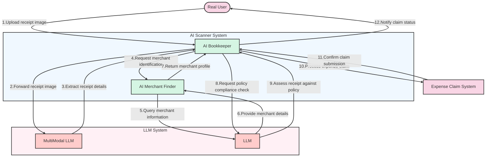
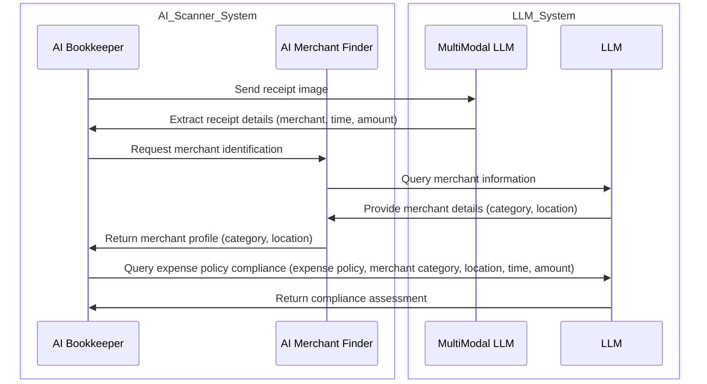
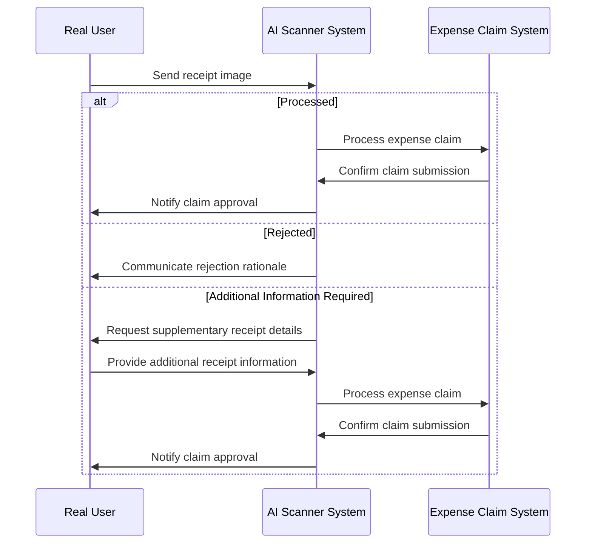

# AI empowered receipt scanner

## AI technologies:

- MultiModal Large Language Model
- Tool/Function calling
- Few-Shots
- Multiple AI Agents framework
- Programmable chain of thought

## Workflow



## Programmable Chain of Thought



## User cases



## Prompts

- AI bookkeeper

```
Role: Bookkeeper

Task: Review expense receipts and determine approval status based on company expense policy and special case exceptions.

Input:

Expense Receipt informations:  merchant, time, amount
Merchant informations: category, location

Output:

Approval Status: One of the following:
APPROVE: The expense is compliant with the policy.
Additional Information Required: The expense is not fully compliant but may be approved with additional documentation.
REJECT: The expense is not compliant with the policy and special case exceptions.

Expense Policy:

[Insert specific expense policy details here, e.g., allowable expense categories, maximum spending limits, required documentation, etc.]

Special Case Exceptions:

[Insert specific exceptions to the expense policy, e.g., emergency expenses, client entertainment, etc.]

Example:

Input:
- Expense Receipt informations:  ABC, $500, 10pm
- Merchant informations: ABC is a restaurant, located in Vancouver

Output:

If the expense policy allows for client entertainment up to $250: Additional Information Required (requires documentation of the business purpose and attendees)
If the expense policy does not allow for client entertainment: REJECT
Note: To provide accurate and consistent approvals, the AI should be trained on a large dataset of expense receipts and policy decisions. It's also essential to regularly update the expense policy and special case exceptions to ensure accurate decision-making.
```

## Competitor

[fyle](https://www.fylehq.com/product/conversational-ai-for-expenses)
