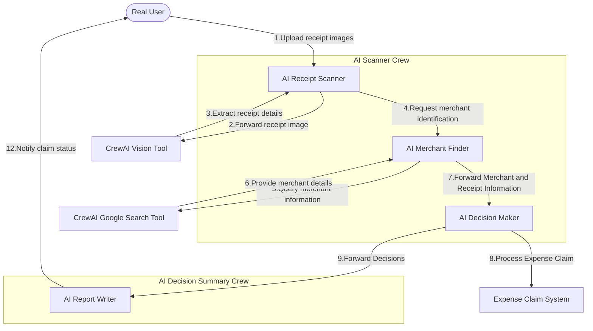
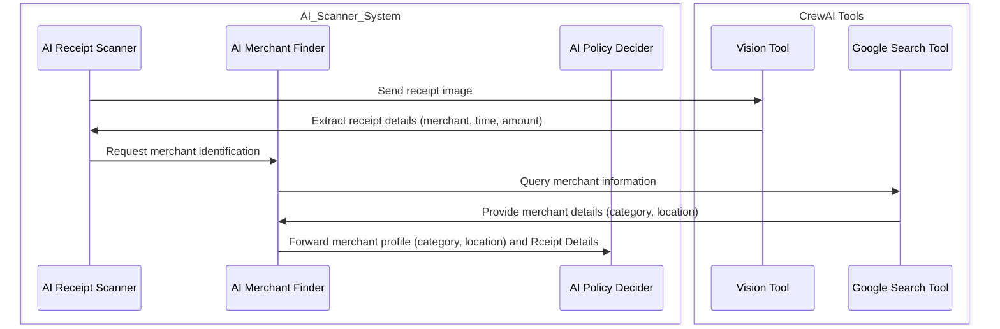
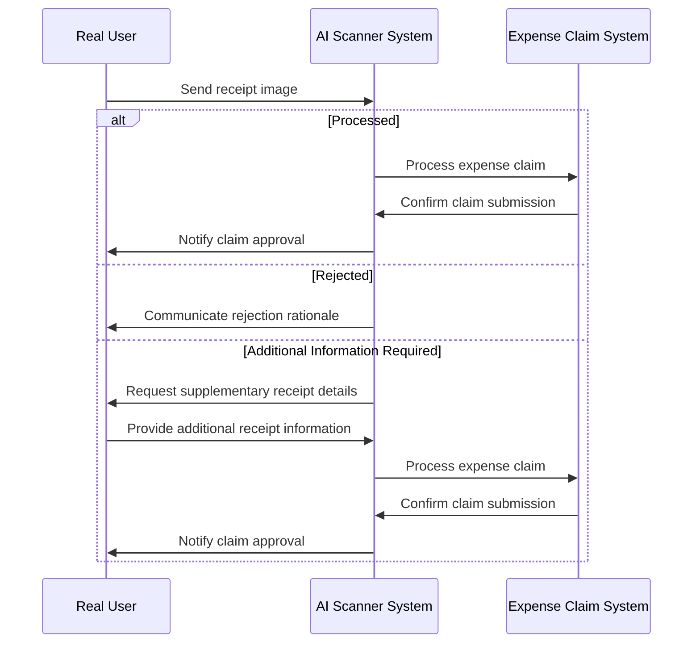

# AI empowered receipt scanner

## AI technologies:

- CrewAI and CrewAI Tools
- CrewAI Vision Tool
- CrewAI Google Serper Search Tool

## Workflow

## Programmable Chain of Thought

## User cases

